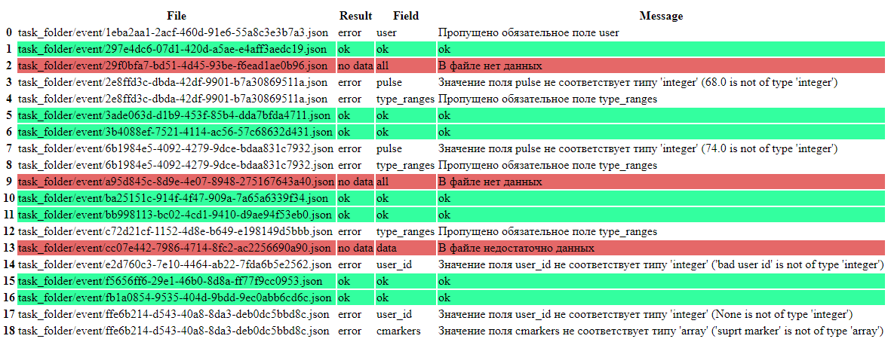

# Валидация JSON на соответствие схемам

## Формулировка задания:
> В архиве есть две папки. 
> Одна с JSON файлами.
> Вторая папка с JSON схемами для файлов из первой. Часть схем 100% правильных, часть нет.
> Необходимо написать скрипт, который сможет найти максимальное количество ошибок структуры и данных в первой папке.
> Примечание: часть ошибок может быть связано с JSON схемой, может с самими данными и ключами для них.
> В результате работы скрипта, надо показать какие файлы не валидны, какие там ошибки и для каждой ошибки на человеко-понятном языке указать как данные исправить.
> Вывод скрипта положить в файл (логом или html таблицей), который сможет прочитать не разработчик.

## Примечания:
* Если прогонять каждый json-файл по всем четырем схемам, ошибок получается в два раза больше.
Однако логика заставляет предположить, что каждый файл генерировался все же в соответствии со своей собственной схемой, и следует учитывать именно отклонения файла от его схемы.
* Сами схемы тоже не все проходят валидацию, но их проверка не входила в задание.
* Если бы необходимо было регулярно искать ошибки в json-файлах, я бы доработала сами схемы, включив в них человекопонятные сообщения об ошибках, а не только описание типа данных.

## Порядок работы:

1. Скачайте репозиторий на свой компьютер.
2. Установите зависимости:
```pip install -r requirements.txt```
3. Запустите скрипт:
```python test.py```
4. В файле test.html вас будут ждать результаты валидации с цветовой маркировкой.



## Результаты валидации
|File|Result|Field|Message|
|---|---|---|---|
|task_folder/event/1eba2aa1-2acf-460d-91e6-55a8c3e3b7a3.json|error|user|Пропущено обязательное поле|
|task_folder/event/297e4dc6-07d1-420d-a5ae-e4aff3aedc19.json|ok|ok|ok|
|task_folder/event/29f0bfa7-bd51-4d45-93be-f6ead1ae0b96.json|no data|all|Файл пустой|
|task_folder/event/2e8ffd3c-dbda-42df-9901-b7a30869511a.json|error|pulse|Значение не соответствует типу 'integer'|
|task_folder/event/2e8ffd3c-dbda-42df-9901-b7a30869511a.json|error|type_ranges|Пропущено обязательное поле|
|task_folder/event/3ade063d-d1b9-453f-85b4-dda7bfda4711.json|ok|ok|ok|
|task_folder/event/3b4088ef-7521-4114-ac56-57c68632d431.json|ok|ok|ok|
|task_folder/event/6b1984e5-4092-4279-9dce-bdaa831c7932.json|error|pulse|Значение не соответствует типу 'integer'|
|task_folder/event/6b1984e5-4092-4279-9dce-bdaa831c7932.json|error|type_ranges|Пропущено обязательное поле|
|task_folder/event/a95d845c-8d9e-4e07-8948-275167643a40.json|no data|all|В файле нет данных|
|task_folder/event/ba25151c-914f-4f47-909a-7a65a6339f34.json|ok|ok|ok|
|task_folder/event/bb998113-bc02-4cd1-9410-d9ae94f53eb0.json|ok|ok|ok|
|task_folder/event/c72d21cf-1152-4d8e-b649-e198149d5bbb.json|error|type_ranges|Пропущено обязательное поле|
|task_folder/event/cc07e442-7986-4714-8fc2-ac2256690a90.json|no data|data|В файле недостаточно данных|
|task_folder/event/e2d760c3-7e10-4464-ab22-7fda6b5e2562.json|error|user_id|Значение не соответствует типу 'integer'|
|task_folder/event/f5656ff6-29e1-46b0-8d8a-ff77f9cc0953.json|ok|ok|ok|
|task_folder/event/fb1a0854-9535-404d-9bdd-9ec0abb6cd6c.json|ok|ok|ok|
|task_folder/event/ffe6b214-d543-40a8-8da3-deb0dc5bbd8c.json|error|user_id|Значение не соответствует типу 'integer'|
|task_folder/event/ffe6b214-d543-40a8-8da3-deb0dc5bbd8c.json|error|cmarkers|Значение не соответствует типу 'array'|
